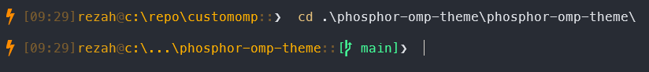

# Phosphor Oh My Posh Theme

A custom Oh My Posh theme with a retro color scheme.



## Features

- Clean, minimal design with power icon indicator
- Current time display
- Username and path information
- Git branch display
- Execution time indicator for slow commands
- Error commands indicator

## Prerequisites

Before using this theme, you need to have Oh My Posh installed on your system.

### Install Oh My Posh

**For Windows (PowerShell):**

```powershell
winget install JanDeDobbeleer.OhMyPosh -s winget
```

**For Windows (via Scoop):**

```powershell
scoop install oh-my-posh
```

**For Windows (via Chocolatey):**

```powershell
choco install oh-my-posh
```

**For Linux/macOS:**

```bash
# Using Homebrew (macOS/Linux)
brew install oh-my-posh

# Or using the install script
curl -s https://ohmyposh.dev/install.sh | bash -s
```

## Installation Steps

### Step 1: Download the Theme File

1. Clone this repository or download the `phosphor.omp.json` file
2. Save the file to a location on your system (e.g., `C:\Users\YourUsername\Documents\phosphor.omp.json`)

### Step 2: Configure PowerShell Profile

1. Open PowerShell
2. Check if you have a PowerShell profile by running:
   ```powershell
   Test-Path $PROFILE
   ```
3. If it returns `False`, create a profile:
   ```powershell
   New-Item -Path $PROFILE -Type File -Force
   ```
4. Open your profile in a text editor:
   ```powershell
   notepad $PROFILE
   ```
   Or use your preferred editor:
   ```powershell
   code $PROFILE
   ```

### Step 3: Add Theme Configuration

Add the following lines to your PowerShell profile (replace the path with your actual theme file location):

```powershell
oh-my-posh init pwsh --config "C:\path\to\phosphor.omp.json" | Invoke-Expression
```

**Example:**

```powershell
oh-my-posh init pwsh --config "C:\Users\YourUsername\Documents\phosphor.omp.json" | Invoke-Expression
```

### Step 4: Install Required Fonts (Optional but Recommended)

Oh My Posh uses special characters and icons. For the best experience, install a Nerd Font:

1. Download a Nerd Font from [nerdfonts.com](https://www.nerdfonts.com/font-downloads)
   - Recommended: **MesloLGS NF**, **FiraCode Nerd Font**, or **Cascadia Code**
2. Install the font by:
   - Extracting the downloaded zip file
   - Right-clicking on the font files (.ttf)
   - Selecting "Install" for each font
3. Configure your terminal to use the Nerd Font:
   - **Windows Terminal**: Settings → Appearance → Font → Select your Nerd Font
   - **PowerShell**: Right-click title bar → Properties → Font → Select your Nerd Font

### Step 5: Reload Your Profile

After saving your profile, reload it:

```powershell
. $PROFILE
```

Or simply close and reopen your PowerShell window.

## Verification

After completing the installation, you should see:

- A power icon (⚡) at the beginning of your prompt
- Current time in brackets
- Your username
- Current directory path
- Git branch name (if in a git repository)
- A prompt symbol (❯) at the end

## Troubleshooting

### Theme Not Loading

1. Verify the path to `phosphor.omp.json` is correct in your profile
2. Check that the file exists at the specified location
3. Ensure Oh My Posh is installed: `oh-my-posh --version`

### Icons Not Displaying Correctly

1. Make sure you've installed a Nerd Font
2. Configure your terminal to use the Nerd Font
3. Restart your terminal after changing the font

### Profile Not Loading

1. Check your execution policy:
   ```powershell
   Get-ExecutionPolicy
   ```
2. If it's `Restricted`, set it to `RemoteSigned`:
   ```powershell
   Set-ExecutionPolicy RemoteSigned -Scope CurrentUser
   ```

## Customization

You can customize the theme by editing `phosphor.omp.json`:

- Change colors in the `palette` section
- Modify segments in the `blocks` section
- Adjust templates and properties for each segment

After making changes, reload your profile: `. $PROFILE`

## For Other Shells

### Git Bash

Add to your `~/.bashrc`:

```bash
eval "$(oh-my-posh init bash --config /path/to/phosphor.omp.json)"
```

### Zsh (macOS/Linux)

Add to your `~/.zshrc`:

```zsh
eval "$(oh-my-posh init zsh --config /path/to/phosphor.omp.json)"
```

### Fish

Add to your `~/.config/fish/config.fish`:

```fish
oh-my-posh init fish --config /path/to/phosphor.omp.json | source
```

## License

This theme is provided as-is for personal use.
